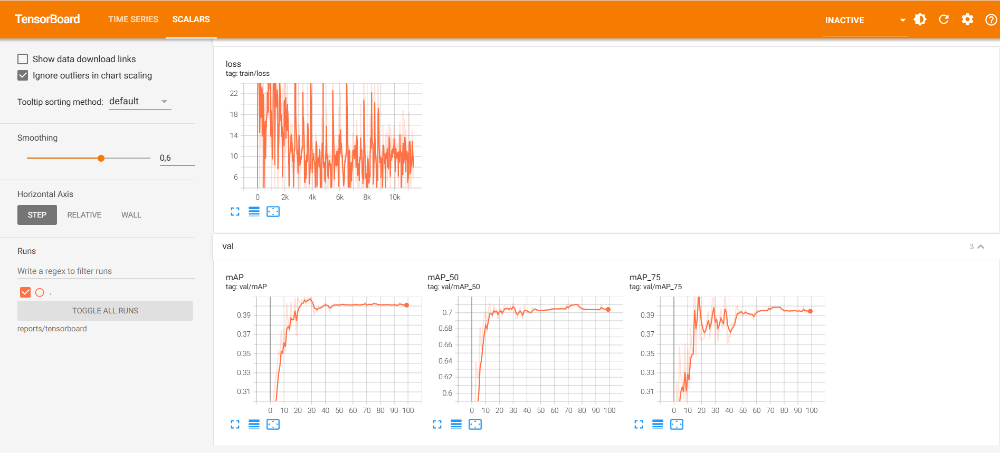

# Helmet  (object detection using faster cnn)

Ứng dụng học sâu (Deep Learning) vào bài toán phát hiện các đối tượng ko đội mũ bảo hiểm

---

## 1.chức năng
- dự đoán trong ảnh có những đối tượng nào đội mũ ko đội mũ
- bao gồm 2 class :
  - Without Helmet
  - With Helmet

## 2. kết quả quá trình train


---

## 3. Cấu trúc thư mục

```text
helmet_detection/
├── data
│   ├── processed
│   │   ├── train
│   │   │   ├── images
│   │   │   └── labels
│   │   └── val
│   │       ├── images
│   │       └── labels
│   ├── raw
│   │   ├── annotations
│   │   └── images
│   └── test
├── reports
│   └── tensorboard
├── results
├── src
└── trained_models
```
## 4 Dataset

### 4.1 Tải dữ liệu

- Kaggle (khuyên dùng):  
  https://www.kaggle.com/datasets/andrewmvd/helmet-detection


### 4.2 Cách dùng dữ liệu
1.Đặt vào thư mục:
```text
data/raw/
```

## 5. Cài đặt

### 5.1 Tạo môi trường ảo (khuyên dùng)

```bash
python -m venv venv
```

**Windows**
```bash
venv\Scripts\activate
```

**Linux / macOS**
```bash
source venv/bin/activate
```

---

### 5.2 Cài thư viện

```bash
pip install -r requirements.txt
```

## 6. chỉnh cấu hình tham số mặc định
```text
config.py
```

---

## 7 Train model **(BẮT BUỘC)**

### 7.1 chạy các lệnh sau

```bash
python -m src.train 
```

### 7.2 Model sau khi train sẽ nằm trong:
```text
trained_models/best_cnn.pt
trained_models/last_cnn.pt
```

---
## 8. chạy docker file

```bash
docker build -t helmet .

docker run  --rm -v ${PWD}/data:/Helmet/data -v ${PWD}/trained_models:/Helmet/trained_models helmet 
```

## 9. xem quá trình train và triển khai test thử

1. xem quá trình train
```bash
tensorboard --logdir reports/tensorboard
```
2. test thử
```text
python -m src.inference -p (đường dẫn ảnh)
python -m src.inference -v (đường dẫn video)
```
- kết quả sẽ đc lưu trong folder results


